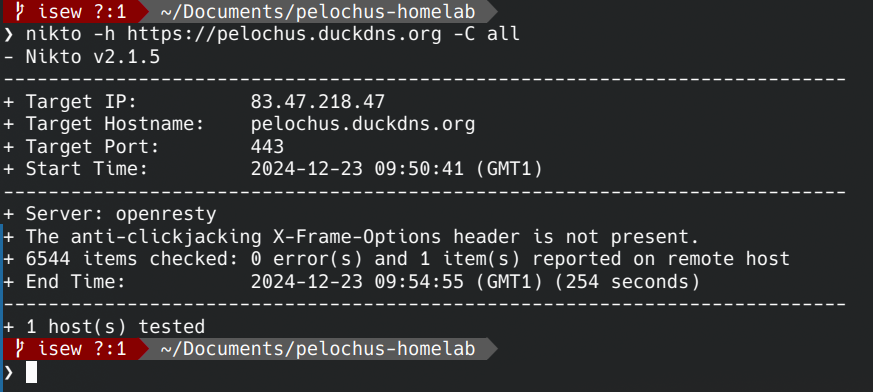
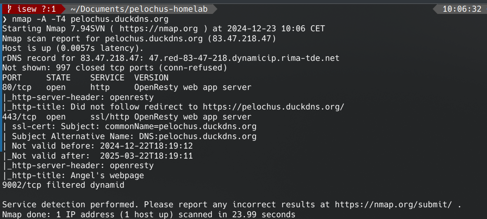
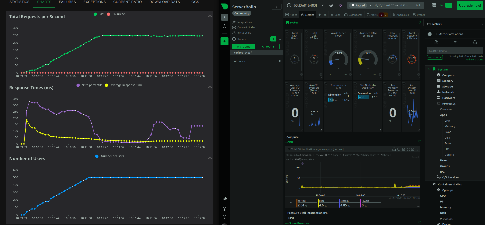

# Tests
Se realizaron los siguientes tests para evaluar la calidad de la página:

## Google PageSpeed Insights
Herramienta de Google para evaluar el rendimiento de una página web. Incluye recomendaciones, incluso de seguridad:

https://pagespeed.web.dev/

## Nikto
Es interesante ver la seguridad de una web. Un escaneo rápido con Nikto tiene buena pinta:

## Nmap
Vamos a ver que devuelve un escaneo rápido de Nmap:

## Locust
Y por último que menos que un test de carga con Locust:

